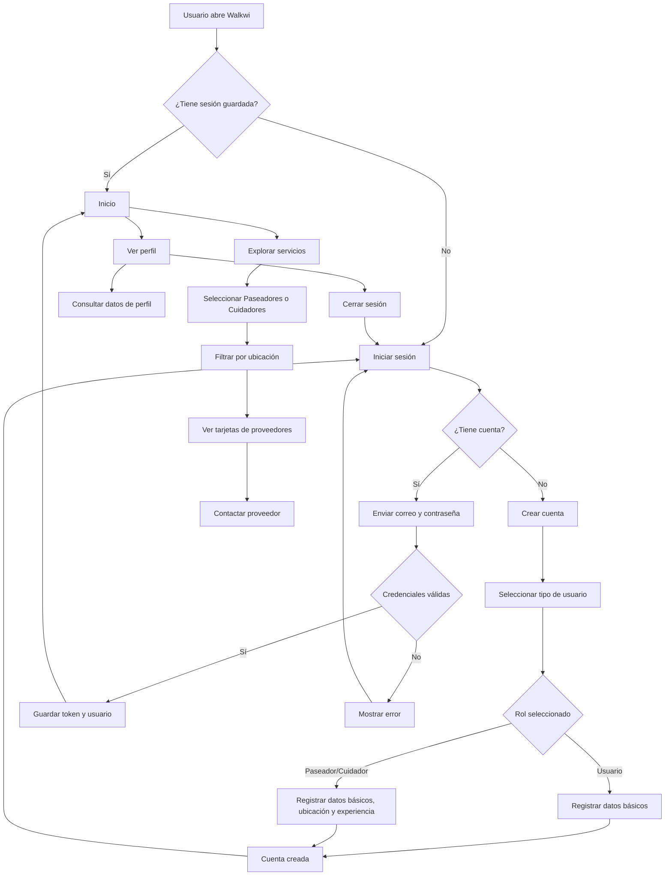
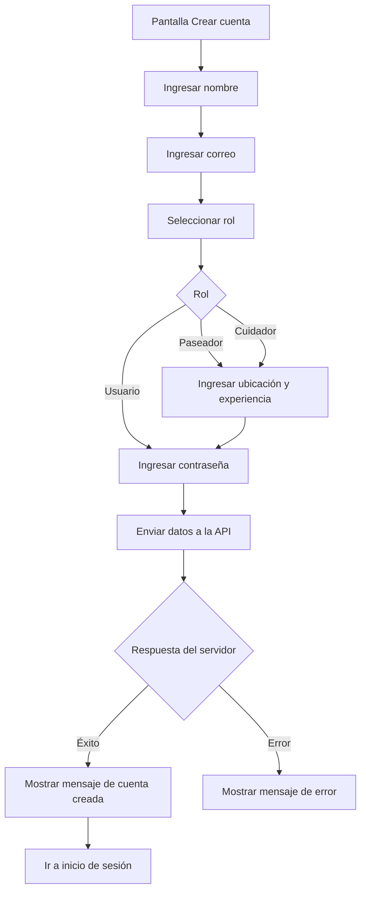
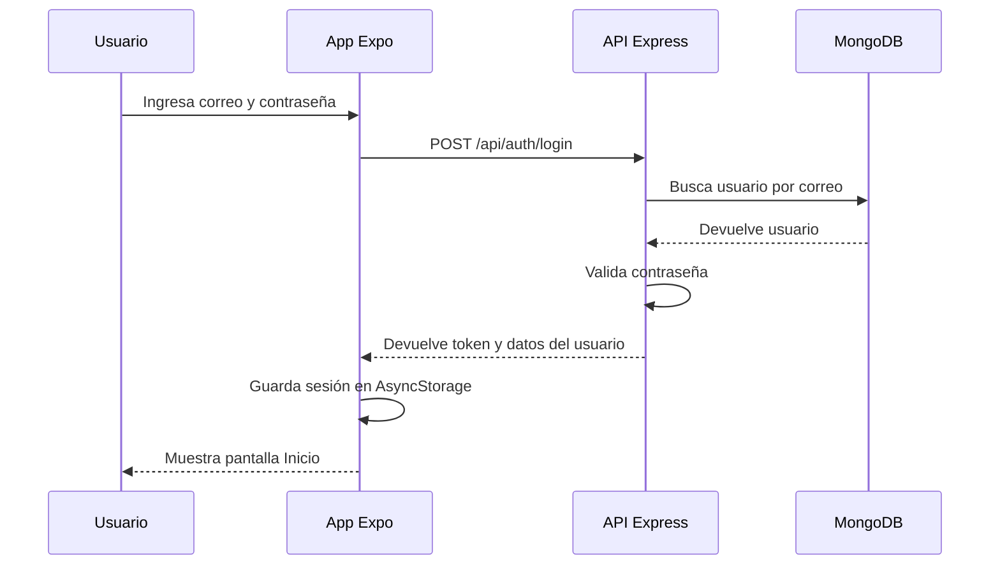
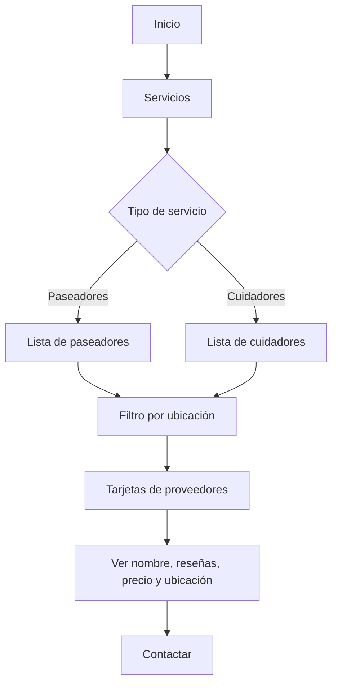
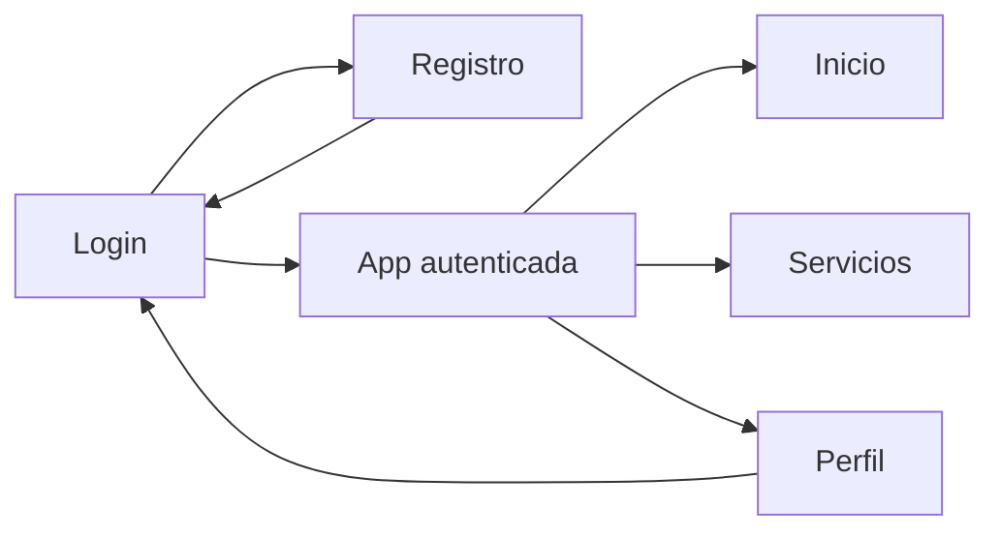
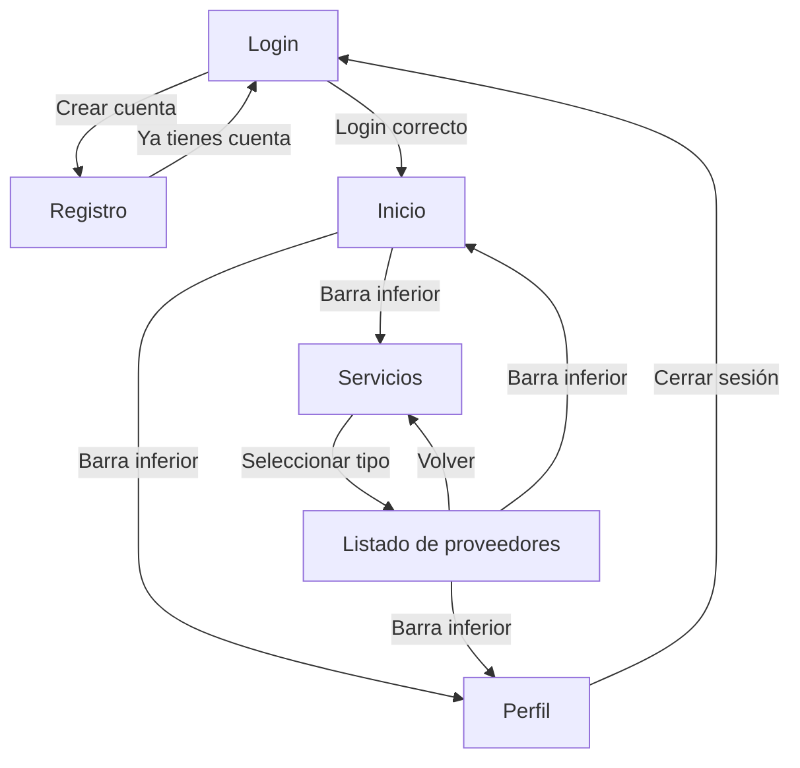

# Walkwi - Flujo funcional, requisitos y navegación

## 1. Diagramas del flujo funcional

### Flujo general de la aplicación

### Flujo de registro

### Flujo de inicio de sesión

### Flujo de servicios

## 2. Listado de requisitos a considerar

### Requisitos funcionales

1. El usuario debe poder crear una cuenta.
2. El usuario debe poder seleccionar su rol: Usuario, Paseador o Cuidador.
3. Si el rol es Paseador o Cuidador, el sistema debe solicitar ubicación y experiencia.
4. El usuario debe poder iniciar sesión con correo y contraseña.
5. El sistema debe guardar la sesión localmente usando almacenamiento compatible con React Native.
6. El usuario autenticado debe acceder a la pantalla de Inicio.
7. La app debe mostrar una barra de navegación inferior con Inicio, Servicios y Perfil.
8. El usuario debe poder consultar servicios disponibles.
9. El usuario debe poder elegir entre Paseadores y Cuidadores.
10. El usuario debe poder filtrar servicios por ubicación.
11. El usuario debe poder visualizar tarjetas de proveedores con nombre, calificación, reseñas, experiencia, ubicación y precio.
12. El usuario debe poder acceder a su perfil.
13. El usuario debe poder cerrar sesión.
14. La app debe conectarse con la API Express para registro e inicio de sesión.
15. El backend debe validar datos obligatorios, correo duplicado y credenciales.

### Requisitos no funcionales

1. La aplicación debe compilar correctamente con Expo SDK 54.
2. La interfaz debe ser compatible con dispositivos móviles.
3. La navegación debe funcionar sin depender de `react-router-dom`.
4. El almacenamiento de sesión debe funcionar sin `localStorage`.
5. La app debe manejar errores de conexión con mensajes claros.
6. El backend debe permitir conexiones desde Expo Go en red local.
7. La app debe mantener una estructura visual consistente.
8. El diseño debe ser simple, táctil y legible en pantallas pequeñas.
9. Las dependencias deben estar alineadas con la versión de Expo Go usada.
10. La API debe proteger las contraseñas mediante cifrado antes de guardarlas.

### Requisitos técnicos

1. Usar React Native con Expo.
2. Usar `AsyncStorage` para guardar token y datos de usuario.
3. Usar `fetch` para consumir la API.
4. Usar Express para el backend.
5. Usar MongoDB como base de datos.
6. Usar JWT para generar token de sesión.
7. Usar `bcryptjs` para cifrar contraseñas.
8. Configurar `EXPO_PUBLIC_API_URL` cuando se pruebe en dispositivo físico si la detección automática no coincide con la red.

## 3. Diseño del flujo de navegación

### Estructura principal

### Navegación detallada

### Pantallas de la aplicación

| Pantalla | Objetivo | Acciones principales |
| --- | --- | --- |
| Login | Autenticar al usuario | Iniciar sesión, ir a registro |
| Registro | Crear cuenta nueva | Elegir rol, completar datos, registrar |
| Inicio | Resumen del usuario | Ver estadísticas, acceder a servicios o perfil |
| Servicios | Buscar proveedores | Elegir tipo, filtrar ubicación, contactar |
| Perfil | Ver información del usuario | Consultar datos, cerrar sesión |

### Estados principales de navegación

| Estado | Descripción |
| --- | --- |
| `login` | Pantalla pública para iniciar sesión |
| `register` | Pantalla pública para crear cuenta |
| `home` | Pantalla inicial después de autenticarse |
| `services` | Pantalla de exploración de servicios |
| `profile` | Pantalla de perfil y cierre de sesión |

### Reglas de navegación

1. Si no hay sesión guardada, la app inicia en `login`.
2. Si hay sesión guardada, la app inicia en `home`.
3. Desde `login` se puede ir a `register`.
4. Desde `register` se puede volver a `login`.
5. Después de iniciar sesión correctamente, la app navega a `home`.
6. La barra inferior solo aparece en pantallas autenticadas.
7. Cerrar sesión borra los datos locales y devuelve al usuario a `login`.
